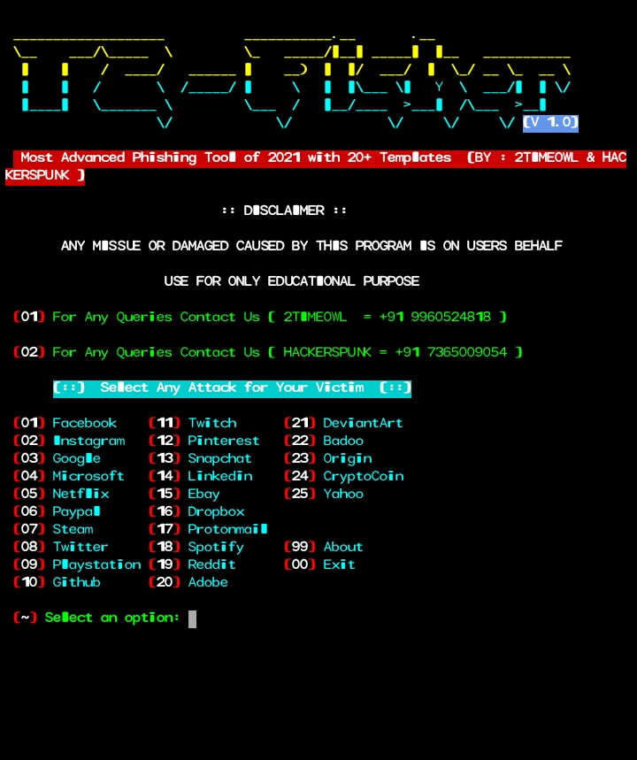
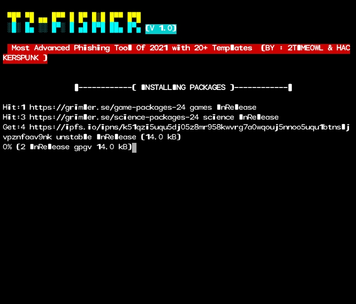
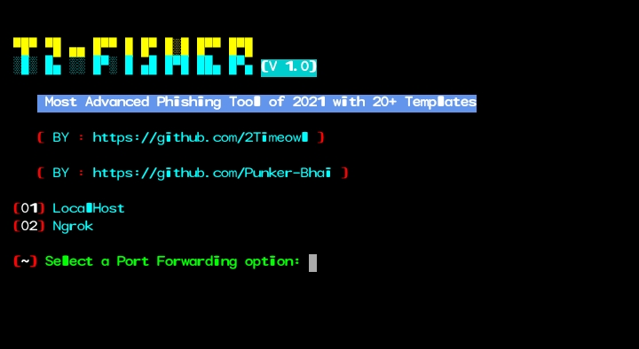
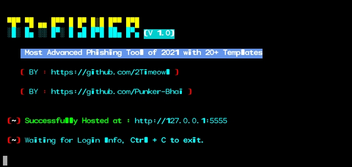

# ABOUT TOOL

T2-fisher is a advanced phishing tool with 20+ Templates. The tool is made for Phishing. It works on both Rooted and Non-Rooted device.

# AVAILABLE ON

* Termux
* Linux

# INSTALLATION COMMANDS

* apt-get update
* apt-get upgrade
* pkg install git -y
* git clone https://github.com/Technocyber/T2-fisher
* ls
* cd T2-fisher
* ls
* bash setup
* bash T2-fisher

# SCREENSHOTS

* Installation

# CONTRIBUTORS 

Special Thanks to Hackerspunk for helping me in this project.

# WARNING 

The tool is made for only educational purpose. We are not responsible for any misuse and damaged caused by this program.
