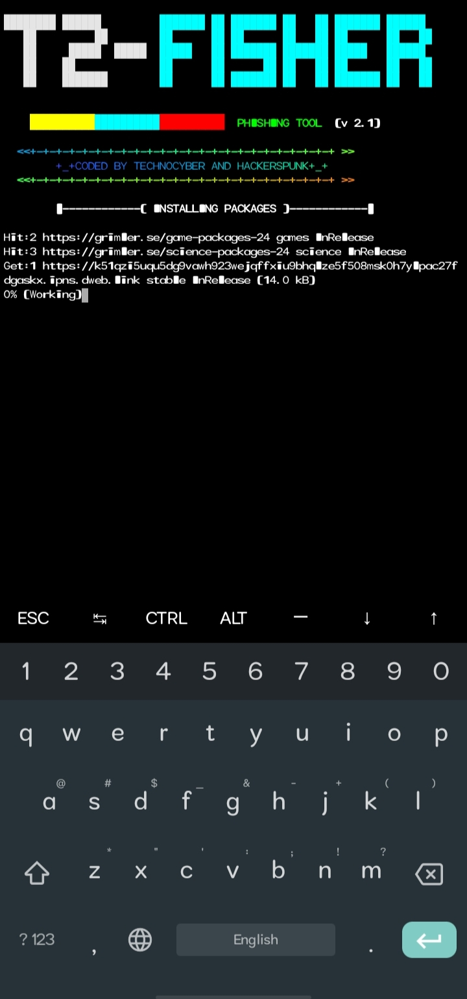
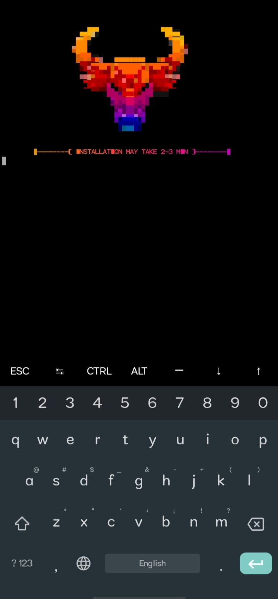
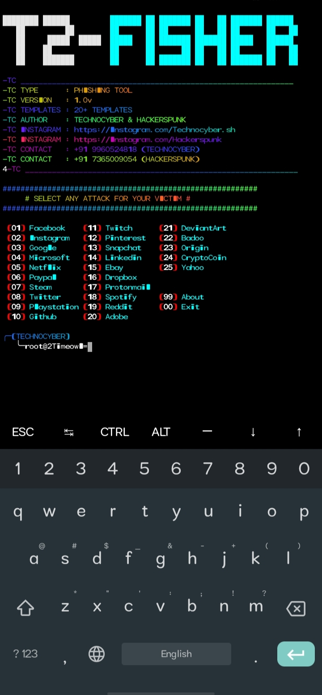
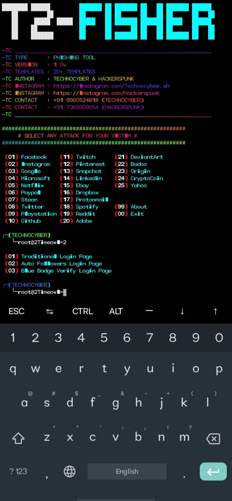
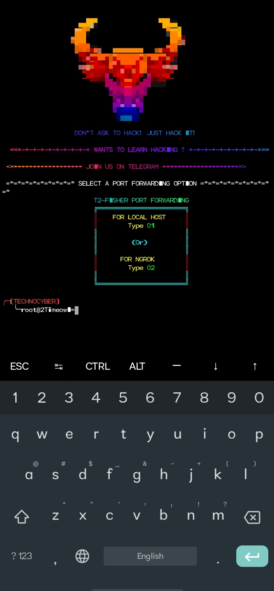
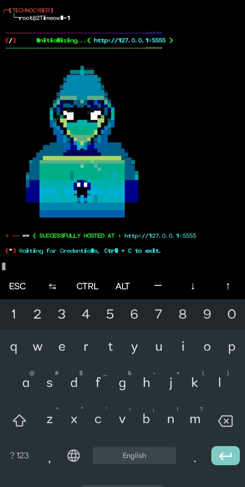

<p align="center">
<a href="https://Genixcyber.cf/Genix-cyber"></a>
</p>
<a href="https://Genixcyber.cf"></a>
</p>
<p align="center">
<a href="https://gitHub.com/Genixcyber"></a>
<a href="https://Instagram.com/Genixcyber"></a>
</p>
<p align="center">
<a href="https://t.me/Genixcyber"></a>
<a href="https://linktr.ee/Genixcyber"></a>
<a href="https://youtube.com/channel/UCototzq-p62RvVcIUr3SXmw"></a>
<p align="center">
<p align="center">
</p>

# ABOUT TOOL


**[`T2-fisher is a advanced phishing tool with 20+ Templates. The tool is made for Phishing. It works on both Rooted and Non-Rooted device.
`](#)**

# AVAILABLE FOR

**[`Linux`](#)**

**[`Termux`](#)**

# INSTALLATION COMMANDS

```
apt update
apt upgrade -y
apt install git -y
git clone https://github.com/Genixcyber/T2-fisher.git
cd T2-fisher
bash install.sh
```


# PREVIEWS

> **[`INSTALLATION`](#)**

|`INSTALLING`|`DEPENDENCIES`|
|--|--|
|||

|`MAIN`|`MENU`|
|--|--|
|||

|`PORT FORWADING`|`LINK GENERATED`|
|--|--|
|||


# CONTRIBUTORS 

> **[`Special Thanks to `Network Slutter` , `ABHacker` & `Htr-Tech` for helping me in this project.
`](#)**

# WARNING 

> **[`The tool is made for only educational purpose. We are not responsible for any misuse and damaged caused by this program.
`](#)**
